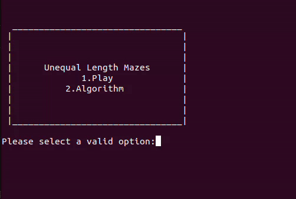
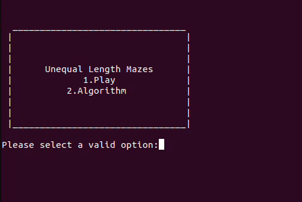

## Specification of the game

Find a path from the bottom left to the top right passing through every white square exactly once. Your path must alternate horizontal and vertical segments, and two consecutive segments can not be the same length. Each puzzle has a unique solution.

## Requirements

Before running the program you must install the following packages:

- colorama
- keyboard
- pynput

You can install them using the following command:

```
pip install package_name
```

## Run the program

Execute "python3 unequal_maze.py" on the src folder.

## Use the program

A menu will be displayed for the user to choose 1 if they want to play the game or 2 if they want the computer to solve a maze.


If the user chooses option number 2, they will also have to select the algorithm and then the computer will start solving it. When it finishes
the user can watch the building of the solution.



If the option 1 is chosen, the user has to solve the maze using the WASD keys to move.




